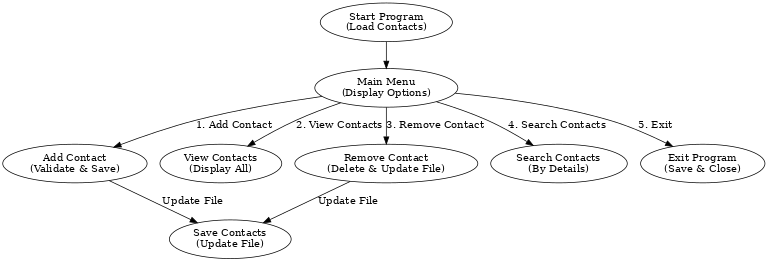

# CLI Contact Book Management System

This project is a Command Line Interface (CLI) application for managing a Contact Book. It allows users to add, view, search, and delete contacts while ensuring data persistence in a file. The project is built entirely using Python, applying fundamental programming concepts.

---

## Features
- **Add Contacts**: Save contact details (Name, Email, Phone Number, and Address).
- **Prevent Duplicate Numbers**: Ensures unique phone numbers for each contact.
- **View Contacts**: Displays all saved contacts in a user-friendly format.
- **Save to File**: Automatically saves contact information to a file.
- **Load from File**: Loads previously saved contacts on program start.
- **Remove Contacts**: Allows users to delete contacts.
- **Search Contacts** (Bonus): Search for specific contacts by their details.
- **Error Handling** (Bonus): Displays clear error messages for invalid inputs.

---

## File Structure
```
contact_book/
│
├── main.py               # Entry point for the program
├── add_contact.py        # Functions to add and validate contacts
├── view_contacts.py      # Functions to display contacts
├── remove_contact.py     # Functions to delete contacts
├── search_contact.py     # Functions to search contacts
└── file_operations.py    # Functions to handle file operations
```

---

## Getting Started

### Prerequisites
- Python 3.x installed on your machine.

### Installation
1. Clone the repository:
   ```bash
   git clone <repository-link>
   cd contact_book
   ```

2. Run the program:
   ```bash
   python main.py
   ```

---

## Usage
1. **Run the program**:
   On starting, the program will load existing contacts from the file.
2. **Menu Options**:
   - Choose from options to Add, View, Search, Remove Contacts, or Exit the program.
3. **Contacts Persistence**:
   Contacts are saved automatically after every addition or deletion.

---

## Application Design
The application is modular, with separate Python files handling distinct functionalities. Below is the workflow:

1. **Start Program**:
   - Load existing contacts from the file.
2. **Menu System**:
   - Interact through a menu to access features.
3. **Core Features**:
   - Add, View, Search, or Remove contacts.
4. **File Handling**:
   - Ensure data persistence through file operations.
5. **Exit Program**:
   - Save unsaved changes and exit gracefully.

---

## Bonus Features
- **Search Contacts**: Find contacts by name, email, or phone number.
- **Error Handling**: Guides users on resolving input errors.

---

## Diagram


---

## Author
This project was developed as part of Module 5's assignment to enhance Python CLI application development skills.

---

## License
This project is open-source and available for educational purposes. Feel free to contribute or modify as needed.
